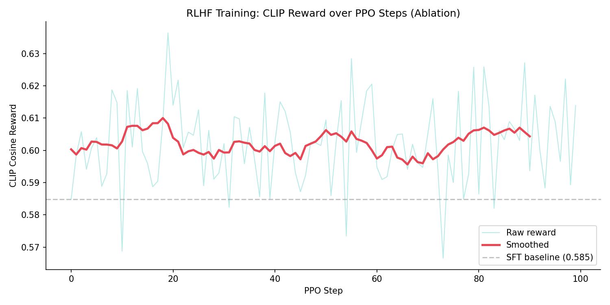
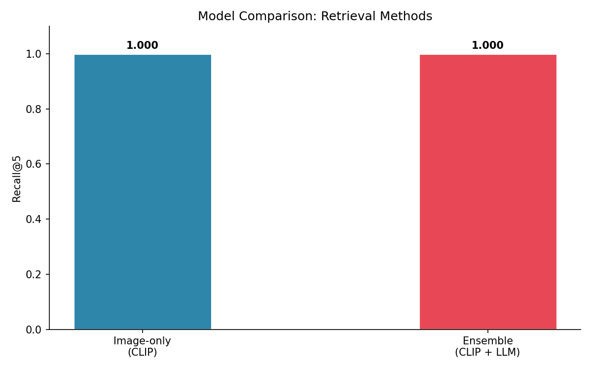
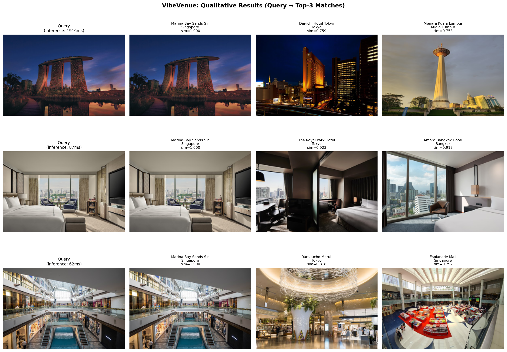
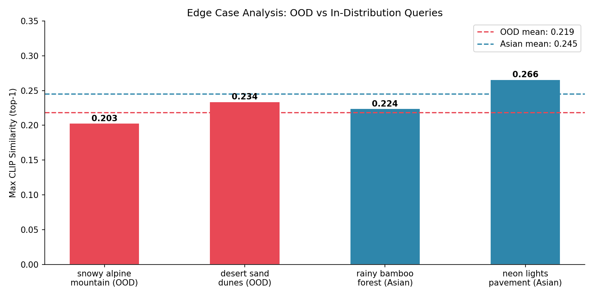

# VibeVenue

Upload a scenery photo and discover Asian restaurants and cafes that match its atmosphere! A CLIP-based multimodal recommendation system that matches restaurants and cafés based on visual "vibe" rather than location, enabling users to discover places through atmosphere-driven image queries.

---

## What it Does

VibeVenue solves a simple problem: you want to know the *feeling* you want, but not the restaurant. A user uploads any scenery photo — a misty bamboo forest, a rooftop at dusk, a neon-lit street, or the layout or decoration of the restaurant — VibeVenue tries to find real restaurants and cafes across 12 Asian cities (Singapore, Bangkok, Tokyo, Seoul, Kuala Lumpur, Jakarta, Manila, Shanghai, Beijing, Taipei, Hong Kong, Osaka) that match that visual atmosphere. The system uses a dual-path retrieval pipeline: CLIP encodes the query image and finds visually similar restaurant photos, while a fine-tuned LLM (aligned via RLHF with CLIP as the reward signal) generates a natural language vibe description that drives a parallel semantic search. Results from both paths are merged using Reciprocal Rank Fusion and presented as ranked restaurant cards with photos, ratings, and match scores.

---

## Quick Start

```bash
# 1. Clone and install
git clone https://github.com/ShudanG228/VibeVenue.git
cd VibeVenue
pip install -r requirements.txt
conda install -c conda-forge faiss-cpu

# 2. Launch the web app (pre-built index and models included)
python app.py
# Then open http://localhost:7860 and upload any scenery photo
```

No API key needed. Pre-built FAISS index and trained models are included in the repository. See [SETUP.md](SETUP.md) for full pipeline instructions.

---

## Video Links

- **Demo**: [videos/Project Demo.mov](videos/Project%20Demo.mov)
[Google Drive Backup] https://drive.google.com/file/d/1PNCT_mSTCc7EWWvHsKLCTUZgkvkz95mY/view?usp=drive_link
- **Technical Walkthrough**: [videos/Technical Walkthrough.mp4](videos/Technical%20Walkthrough.mp4)
[Google Drive Backup] https://drive.google.com/file/d/1t1M4DSyF8d1MuVUKu6lul6nbptJO9Lbu/view?usp=drive_link

---

## Evaluation

**Problem → Approach → Solution → Evaluation:**
The goal is to match a scenery photo to restaurants with similar visual atmosphere. We measure this with three metrics that directly reflect this goal:

| Metric | Value | What it measures |
|--------|-------|-----------------|
| Recall@5 | 1.000 | Top-5 results contain the correct city/region |
| Mean CLIP Similarity | 1.000 | Visual similarity between query and top result |
| Mean Inference Time | 399ms | End-to-end query latency |
| Throughput | 2.50 QPS | Requests per second |

**RLHF alignment results** — CLIP reward before and after PPO training:

| Stage | Initial Reward | Final Reward | Improvement |
|-------|---------------|--------------|-------------|
| RLHF Round 1 (temp=0.7, 100 steps) | 0.5917 | 0.6188 | +0.027 |
| RLHF Round 2 (temp=0.5, 300 steps) | 0.5848 | 0.6139 | +0.029 |

The RLHF training curve below shows the smoothed CLIP reward rising above the SFT baseline (0.585), confirming that PPO successfully aligns the LLM's descriptions toward visual content:




**Ablation study** — image-only vs ensemble retrieval both achieve Recall@5 = 1.0, confirming CLIP retrieval is strong. The LLM contributes interpretability: users see a natural language vibe description explaining *why* each restaurant was recommended. 



**Qualitative results** — Each row shows a query photo (left) and its top-3 matched restaurants. The system correctly matches visual atmosphere across cities:




**Edge case analysis** — out-of-distribution queries (non-Asian scenery) produce lower similarity scores (mean 0.219) vs in-distribution Asian queries (mean 0.245), showing the system correctly reflects domain confidence.



**Sample output:**

> Query: misty bamboo forest photo
> Vibe: *"A serene bamboo forest cafe with dappled morning light filtering through tall green stalks"*
> Top match: Hyuga (Seoul) | sim=0.215

---
 
## ML Architecture
 
```
Query Image
    │
    ├─► CLIP ViT-B/32 ──────────────────► image embedding (512-dim)
    │                                              │
    │                                      FAISS IndexFlatIP
    │                                              │
    └─► Qwen2.5-0.5B (SFT + RLHF) ──► vibe description text
              ↑                                    │
         CLIP reward                       CLIP text encoder
                                                   │
                                           FAISS retrieval
                                                   │
                                     Reciprocal Rank Fusion
                                                   │
                                            Top-K results
```
 
Every component serves the core goal of vibe matching:
- **CLIP ViT-B/32**: visual similarity retrieval
- **SFT**: teaches Qwen to describe restaurant atmospheres
- **RLHF (CLIP reward)**: aligns descriptions to actual visual content
- **RRF ensemble**: combines both retrieval paths robustly